---
tags:
  - management
draft: false
---

#### Now and future

There are three states of a company at any time:
- now (point A);
- future (point B), where the company **wants to be**;
- future (point X), where the company **doesn't want to be**.

#### Manager's reponsibility
A manager (M) responsibility is to make the transition from A to B happen together with direct reports (DR)

Thus, the M's job is to make DRs move from A to B safely and while helping to achieve BOTH company and individuals' goals. 

While moving, a DR can be in two states: **active** or **passive**.

#### **Active DR**
If the DR moves from A to B actively, then the M's task is to give a positive feedback at least verbally: "It's good. I see what and how you do, continue the same way, please."

```mermaid

flowchart TB
M(now: DR moves towards goals actively)-->F(feedback from M: 👍🏻)-->B(future: B)
F(feedback from M: 👍🏻)-.-> M
```

Moving the other way, i.e. being active towards future point X where the company doesn't want to be, is **NOT** acceptable. 

Manager's tasks here are:
1. to show that the recent actions are against both the company's and individual's goals;
2. come up with an agreement to be back on the track towards B.

```mermaid
flowchart TB
M(now A: DR actively moves towards non-company's goal)-.->C(future X) 
M-->F(feedback from M: 👎🏻)-->Agree(agree on the change ❤️‍🩹)-.->|Change happens|Positive_feedback(feedback from M: 👍🏻)-->B(future B)
Agree-.->|Change doesn't happen|M
```

This also includes toxic ways while reaching B, unless the toxicity is part of a way a company achieves goals. Allowed toxicity is a rare thing for a company competing on the labour market with other companies.
#### **Passive DR** 
(not moving or moving slowly)

The goal of the manager is to unblock a DR. The ways to unblock depend on the root cause of the blocker and always individual agreements needs to be made during 1:1 discussion.

The reasons why people don't do something a manager needs them to do?

1. A person **doesn't want** to do the thing (sees no way the activity will help to achieve the person's goal). Here the uncovered reasons can be
	- is afraid to do that (last time a similar task led to undesired consequencies).
	- doesn't see a need to spend the resources (the gain of doing is less than energy spent).
2. **Doesn't have the mental or physical capacity** at the moment. Often it means being occupied with more urgent or important issues in life besides the work. Examples could be:
	1. health of the person or famliy or friends, incl. bad sleep;
	2. legal issues (even if not criminal related, it could be such issues as real estate, immigration);
	3. uncomfortable living or **working** conditions (noise, toxic colleagues);
	4. safety risks (e.g. war, political instability);
	5. significant necessary spendings;
	6. being tired or exhausted after a period of intense work.
3. **Doesn't have a proper skill**
	- Mind that sometimes people believe they do have the skill before starting the work on a task. The manager's responsibility is to give only the tasks according to the Goldilock rule, i.e. not too boring an not too challenging at the current level of expertise.
4. The goal (task) **is not clear**.
	- A manager can make the goal clear only speaking the same language with the person. The manager should take into account both hard and soft skills, recent experience.

```mermaid
flowchart TD

Task(DR gets a task)-.->|NO desire or ability or skill or clarity|A-.-> X(future X)
Task-.->C(the task delivered)
C-->Positive_feedback(feedback from M: 👍🏻)-->B(future B)
A-->M
M(M detects the blocker) --> M1(M agrees on the way to unblock the DR)-.->|the agreement works|C
M1(agreement on unblocking with DR)-.->|the agreement doesn't work|A(point A: the task IS NOT delivered)
```

[[notes/Why a manager is responsible for everything?|Why a manager is responsible for everything?]]

---
[[publish/Disclaimer|Disclaimer]]
