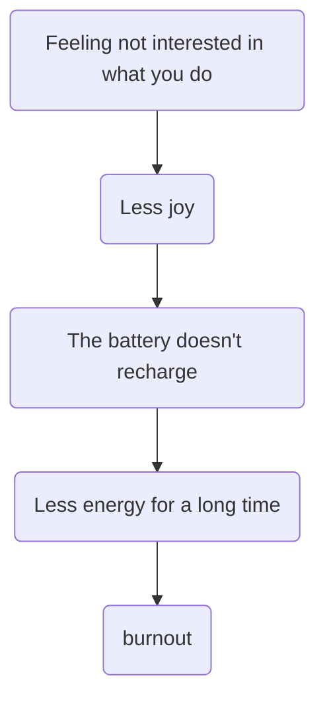

Usual stages that are considered on the road to an emotional burnout

```mermaid 
flowchart TD
A(Feeling not interested in what you do)
B(Less joy)
C(The battery doesn't recharge)
D(Less energy for a long time)
X(burnout)

A-->B-->C-->D-->X
```
---
[[Disclaimer|Disclaimer]]
