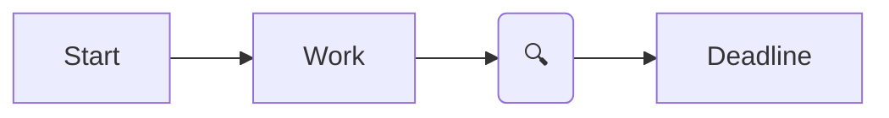
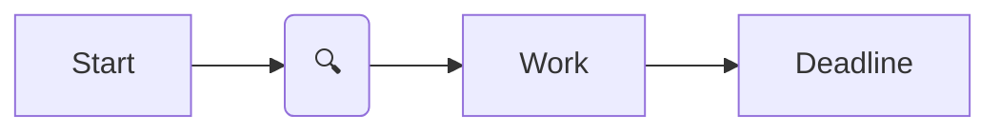
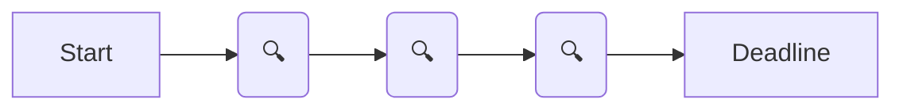
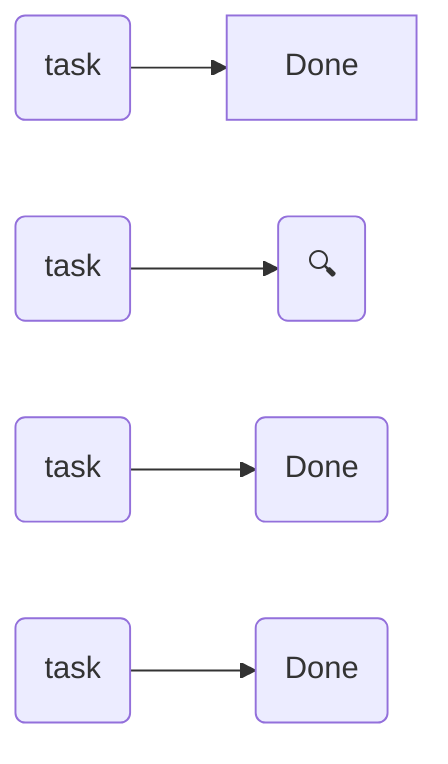

#### 5 types of control
1. At the end, right before a deadline. High confidence a person can and will do the task. Also, small tasks are good candidates for that.
2. Preliminary
3. Each milestone
4. Periodic. Every N units of time (every day, week, month). Depends on a task
5. Selective, Random; when there are too many (conveyor, a random bottle is open for a check)

#### Charts

**1. At the end**

**2. Preliminary**

**3. Each milestone**

**4. Periodic**

**5. Selective, Random**

