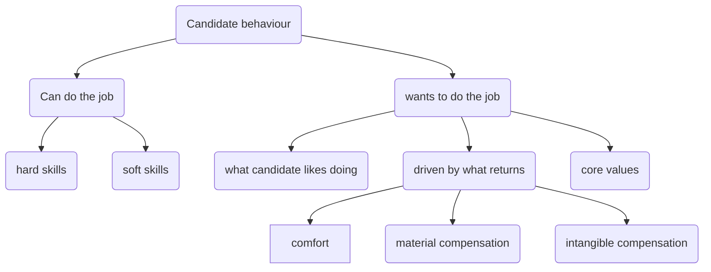
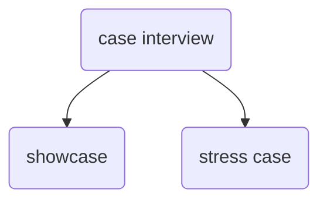

## Goals
The goal of hiring is to get a person (competencies) often for a long time, so the match that will help company to reach long-term goals over time. In a nutshell, as a hiring manager you will need to get the answer to the question if the person will do the job? And following the [[content/notes/Why a manager is responsible for everything?|reasons why people don't do stuff]], the answers to the following questions a hiring manager looks for:
1. does a candidate have necessary hard-skills? (what we can *can-do*)
2. does a candidate want to do the job/tasks we will be offering (*want-do*) - motivation
3. does a candidate have ability to execute in the environment given current conditions (able-to-do)
4. will be a given task clear to the candidate and/or the candidate will be able to clarify a given task. Usually, the level of ambiguity depends on the position seniority.

## How to hire?
We defined the goal of a hiring manager, now let's briefly touch some of the tools a hiring manager can use during the interviews in order to get the necessary signals.

But before that, by now, it should be pretty clear, that a hiring manager should have a mental model of a company/team culture to understand what a person should be to answer the question #3 above, the manager should have at least a general understanding of the expected tasks in a person is being hired for (questions 1, 2).

A structure below can help navigating the mental model for the candidate evaluation.

To get signals you as a hiring manager can employ the following dimensions: 
- evaluate the **past**, e.g. questions about conflict management grounded in the candidate experience
- evaluate the **future**, e.g. what models does a candidate utilize given a case scenario.

Speaking of the case-type interview, there are several subtypes. Feel free to use the cheatsheet below:

WIP

---
[[Disclaimer|Disclaimer]]

