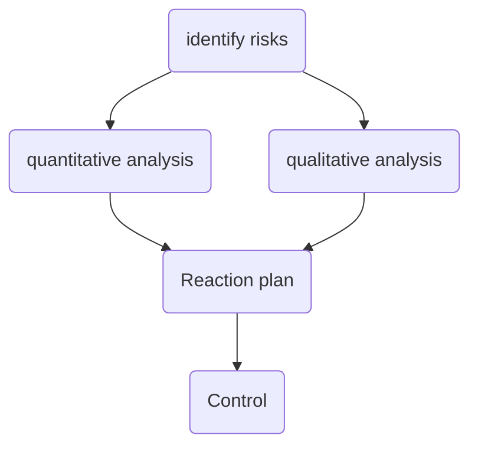
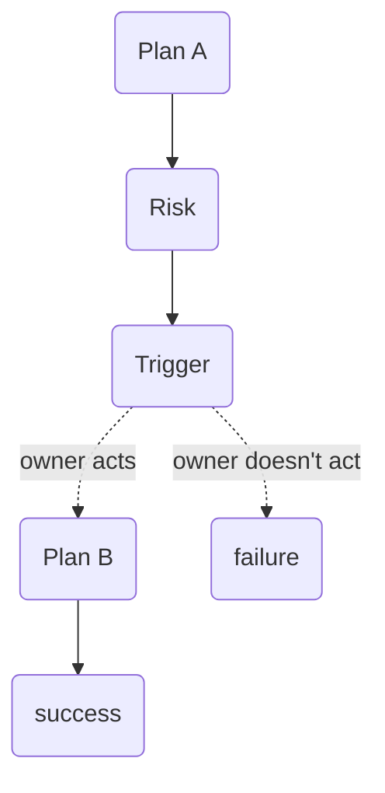

---
tags:
  - management
  - "#risks"
draft:
---
Alright, let's define the risk as a term:
**Risk** - positive or negative event, which can happen or not happen.

As the following techniques applied to risks overall, it means they applied both to positive and negative events that can happen or not.
It's fine to keep different registries for positive and negative though.

#### Algorithm

That will help to fill the following table (example)

| Risk | Probability | Impact | Importance |
| ---- | ----------- | ------ | ---------- |
|      |             |        |            |

#### Reaction plan

| Risk name | Plan A | Plab B | Trigger | Owner |
| --------- | ------ | ------ | ------- | ----- |
|           |        |        |         |       |
Plan A - **before the risk occurs**, our actions to avoid the negative risk or mimize it's potential impact; in case of positive - actions to improve the probability of the risk to happen. The Plan A is immediately being executed after the identification.

Plan B - our actions in case the risk occurred.

A trigger of a risk - a fact (symptom), i.e. answers the question "how to understand the risk got occurred?".

An owner of a risk - a person, who noticed the trigger and understands that the time for the Plan B has come.

There are various strategies for the Plan A: avoid, mitigate, transfer, accept a risk.

---
[[Disclaimer|Disclaimer]]
