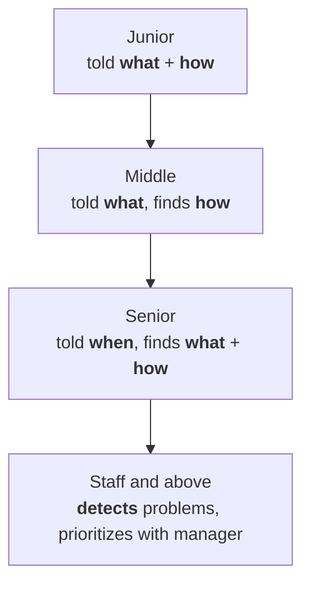

---
draft:
---
In tech, depending on a company, there are various seniority levels engineers have. When faced with a new ladder, I first see if I can apply the following model:

- Junior - requires a lead engineer/manager to tell 
	- **what** task and **how** to do it. And then repeats independently;
- Middle - requires a lead engineer/manager to tell 
	- **only what** to do, and is independent in finding **how**;
- Senior - requires a lead engineer/manager to tell 
	- **when to deliver** scope of work, independently finding out the answers to 'what? how?'
- Staff and above is not expected to have anyone guiding them, and they
	- **detect** the problems/challenges/risks themselves and prioritize for work depending on the priorities aligned with a manager. One type of such a challenge is helping to unblock other engineers time in order to deliver the scope.
 

The titles can differ across companies and might be either be of a lower or a higher number. The above is for demonstration purposes, and should be considered as a imaginable ladder.

On this topic I could recommend the [website](https://staffeng.com) and [the respective book](https://staffeng.com/book), to the ideas of which I can agree or not.
